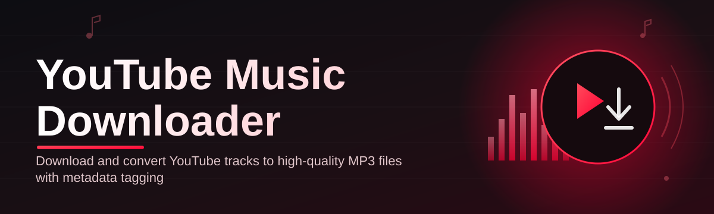
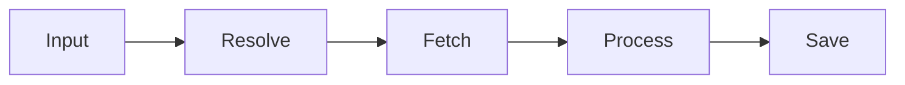

# ytm-dl-tool 🎧⬇️

  

*A dependable YouTube Music downloader built for people who value their library more than their patience.*

## 📀 Overview

**ytm-dl-tool** is a standalone Windows utility for extracting and preserving audio from YouTube Music. It was built on a simple premise: local libraries are more resilient than streaming subscriptions. Services change catalogs, revoke access, or restructure pricing overnight — a folder of correctly-tagged audio files does not.

This project exists because most YouTube Music downloader tools on the market are either abandoned, riddled with bundled adware, or require a command-line fluency most listeners never asked for. ytm-dl-tool takes the opposite approach: a single executable, a clean interface, and a processing pipeline engineered for consistency across thousands of runs, not just a demo.

It's built for archivists, DJs building offline sets, commuters with unreliable connectivity, and anyone who has ever lost a carefully curated playlist to a dead link. If you think of your music collection as infrastructure rather than a rental, this tool is for you.

> [!NOTE]
> ytm-dl-tool is a personal-use utility. Respect content ownership and the terms of service of any platform you interact with.

  

---

## 🧩 What It Actually Does

Six capabilities, no marketing fluff — each one exists because a user asked for it.

- **Batch queue processing** — paste a playlist link once, walk away, come back to a finished folder. The queue engine processes entries sequentially with retry logic baked in.

- **Metadata-aware tagging** — title, artist, album, and cover art are written directly into file tags, not left for you to fix later in a separate app.

- **Format flexibility** — export to MP3 or FLAC depending on whether you're optimizing for space or fidelity.

- **Bitrate control** — choose your own balance between file size and audio quality instead of accepting a fixed default.

- **Resume-on-failure** — a dropped connection doesn't mean starting over; interrupted downloads pick back up from where they stopped.

- **Duplicate detection** — the tool recognizes tracks already present in your target folder and skips redundant re-downloads automatically.

- **Playlist-to-folder mapping** — each playlist can be routed to its own destination folder, keeping large libraries organized without manual sorting.

- **Silent background mode** — minimize to tray and let large batches run without occupying your desktop.

> [!TIP]
> For libraries larger than a few hundred tracks, enable batch queue processing and let the tool run overnight. It's built to be left alone.

---

## 🚀 Getting Started

No package managers. No terminal commands. Four steps.

1. **Visit the landing page** using the download button above.

2. **Download the latest build** — a single portable executable, no installer wizard required.

3. **Run the application** — Windows may show a SmartScreen prompt for unsigned software; choose "Run anyway" if you trust the source.

4. **Paste a link, pick a format, and start your first download.**

> [!IMPORTANT]
> Always download ytm-dl-tool from the official landing page linked in this README. Third-party mirrors are not maintained by this project and may carry altered binaries.

---

## 🖥️ System Requirements

| Component | Requirement |
|---|---|
| **OS** | Windows 10 or Windows 11 (64-bit) |
| **Dependencies** | None — fully standalone |
| **Disk space** | 150 MB minimum, more for large libraries |
| **RAM** | 4 GB minimum, 8 GB recommended |
| **Network** | Stable broadband connection |

> [!NOTE]
> ytm-dl-tool ships as a self-contained binary. There is nothing to install separately and nothing running in the background you didn't launch yourself.

---

## ⚙️ How It Works

The pipeline is intentionally linear — fewer moving parts means fewer failure points.

1. **Input** — a URL or search query enters the queue.
2. **Resolve** — the tool identifies the correct audio stream and its associated metadata.
3. **Fetch** — the stream is pulled down and buffered locally.
4. **Process** — audio is converted to your selected format and bitrate.
5. **Tag & Save** — metadata and cover art are embedded, then the file lands in your destination folder.

---

## 🩹 Common Pitfalls

**Q: The download starts but never finishes.**
A: Usually a network interruption. Resume-on-failure will pick it back up automatically on the next run — just re-add the same link.

**Q: My antivirus flagged the executable.**
A: Unsigned indie tools often trigger heuristic false positives. Verify you downloaded from the official landing page, then whitelist the executable if you're confident in the source.

**Q: Album art isn't showing up in my music player.**
A: Some players cache old thumbnails aggressively. Clear the player's cache or re-import the affected folder.

**Q: A playlist only partially downloaded.**
A: Private or region-locked tracks within a playlist are skipped, not failed. Check the log panel for a per-track status breakdown.

**Q: Audio quality sounds inconsistent between tracks.**
A: Source stream quality varies by upload. Locking a fixed bitrate in settings normalizes output across your whole library.

**Q: The app won't launch after a Windows update.**
A: Re-download the latest build — Windows security policy changes occasionally require a fresh binary signature check.

---

## 🎛️ Interface & Experience

ytm-dl-tool's UI is built for speed, not decoration.

<strong>Keyboard shortcuts</strong>

| Shortcut | Action |
|---|---|
| `Ctrl + V` | Paste link into queue |
| `Ctrl + Enter` | Start queue |
| `Ctrl + P` | Pause active downloads |
| `Ctrl + L` | Open log panel |
| `Esc` | Minimize to tray |

**Themes** — Light and Dark modes ship out of the box, switchable instantly without a restart.

**Settings persistence** — bitrate, format, and destination folder preferences are remembered between sessions.

**Log panel** — a scrollable, real-time record of every queue action, useful for diagnosing partial failures.

> [!TIP]
> Enable Dark mode if you're running long overnight batch sessions — it noticeably reduces eye strain during late-night library building.

---

## 🤝 Contributing & Community

Contributions are welcome, especially around stability and edge-case handling.

- Open an issue for bugs, with steps to reproduce and your Windows version.
- Submit feature requests with a clear use case — "why" matters more than "what."
- Pull requests should target one change at a time; small, reviewable diffs merge faster.

> [!WARNING]
> Please do not submit code that circumvents platform authentication or content protection systems. This project is maintained strictly as a personal-use utility.

Community discussion, roadmap notes, and release changelogs live in the repository's Issues and Discussions tabs.

---

## 📄 License

Released under the [MIT License](LICENSE), 2026.

You're free to use, modify, and distribute this project under the terms of that license.

---

## ⚠️ Disclaimer

ytm-dl-tool is provided for personal, non-commercial use. Users are solely responsible for ensuring their use of this tool complies with the terms of service of any platform they interact with, as well as applicable copyright law in their jurisdiction. This project is not affiliated with, endorsed by, or sponsored by YouTube, YouTube Music, or Google LLC.

---

  

